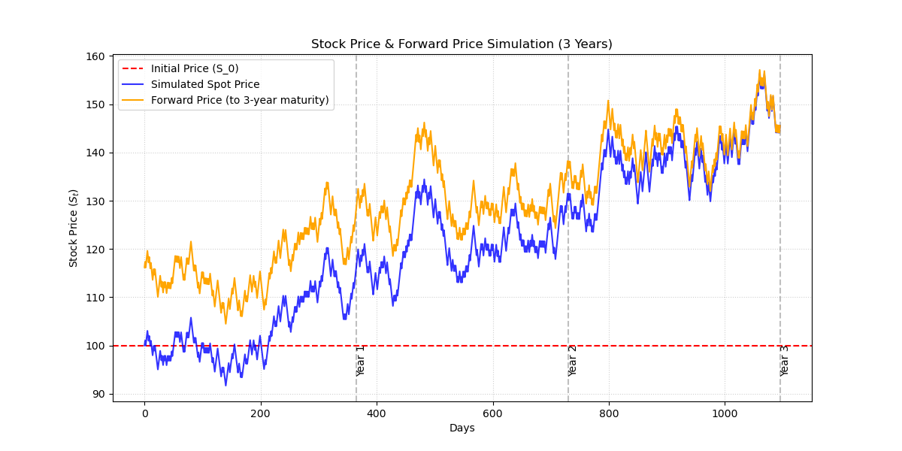

# Quantitative Finance: Binomial Stock Price & Forward Curve Simulator

A Python-based simulation modeling daily stock spot prices using a binomial random walk (coin-toss) approach, paired alongside theoretical forward prices derived from the cost-of-carry model. 

Inspired by introductory quantitative finance concepts (such as asset path modeling and derivatives pricing found in foundational literature like Paul Wilmott's works Chapter 1), this repository serves as an educational sandbox to visualize stochastic price behavior and derivative pricing relationships.

---

## Simulation Preview


*(Example output illustrating a 3-year daily simulated spot price path alongside its converging forward price curve).*

---

## Theoretical Background

Understanding how financial derivatives behave starts with modeling the underlying asset. This script ties together three core pillars of quantitative finance:

### 1. The Binomial Random Walk (Spot Price Modeling)
In real markets, stock prices fluctuate randomly due to incoming news, supply, and demand. To model this, we use a **discrete-time random walk** (the foundation of the Binomial Option Pricing Model):
* **The Coin Toss:** At each time step (representing a day), a fair coin is flipped ($p = 0.5$).
* **Step Volatility ($r_{\text{step}}$):** If "heads," the stock price goes up by a fixed percentage ($S_{t+1} = S_t \times (1 + r_{\text{step}})$). If "tails," it drops by the same percentage ($S_{t+1} = S_t \times (1 - r_{\text{step}})$).
* **Compounding Path:** As these daily percentage steps multiply over time ($n$ days), they form a natural, jagged asset price path that mimics real-world stock volatility.

### 2. Spot Prices ($S_t$) vs. Forward Prices ($F_t$)
* **Spot Price ($S_t$):** The current market price of the stock if you buy or sell it for immediate delivery today.
* **Forward Price ($F_t$):** The locked-in price today for a transaction that will occur at a specific future date (maturity $T$). 

### 3. The Cost-of-Carry Relationship
To price a forward contract without arbitrage, quantitative finance uses the **Cost-of-Carry model**:
$$F(t, T) = S_t \cdot e^{r(T - t)}$$

Where:
* $S_t$ = Current spot price at time $t$.
* $r$ = Annual risk-free interest rate (representing the financing cost or time value of money).
* $(T - t)$ = Time remaining until contract maturity.

**What this practically means:** Because buying a forward contract allows you to defer payment until the future date $T$, the seller must finance or "carry" the asset in the interim. Consequently, the forward price naturally sits *above* the spot price when time remains on the contract.

### 4. Convergence to Maturity
A vital law of derivatives pricing visible in this simulation is **convergence**:
$$\lim_{t \to T} F(t, T) = S_T$$

As the simulation reaches the final day ($t = T$), the time-to-maturity shrinks to zero ($T - t = 0$). At expiration, a forward contract settles immediately, forcing the forward price and spot price to merge into the exact same value. If they did not, risk-free arbitrage opportunities would emerge.

---

## Repository Structure

```text
├── main.py          # Main Python script running the simulation and plotting
├── simulation_plot.png    # Output chart image for documentation
└── README.md              # Project documentation and theoretical guide
```

---

## Getting Started & Running the Code

### Prerequisites
Make sure you have Python installed along with the required scientific computing libraries:
```bash
pip install numpy matplotlib
```

### Running the Script
Clone the repository and run the simulation script:
```bash
python simulation.py
```

---

##  Git & GitHub Push Instructions

If you are setting up this repository locally and pushing it to GitHub for the first time, run the following commands in your terminal:

```bash
# 1. Initialize git in your project folder
git init

# 2. Add all files to staging
git add .

# 3. Commit your files with a descriptive message
git commit -m "Initial commit: Add binomial spot and forward price simulation"

# 4. Connect your local repository to your remote GitHub repo
git branch -M main
git remote add origin https://github.com/YOUR_USERNAME/YOUR_REPOSITORY_NAME.git

# 5. Push the code to GitHub
git push -u origin main
```

---

##  What We Learn From This Code
1. **Mathematical Decoupling:** Separating the **daily step volatility** (`r_step = 0.01`) from the **annualized interest rate** (`R_annual = 0.05`) prevents exponential scale explosions while keeping macro-finance variables realistic.
2. **Dynamic Adaptation:** Forward prices aren't static; they continuously update based on the stochastic wiggles of the underlying spot price.
3. **Arbitrage Bounds:** Visualizing the structural gap between spot and forward curves builds an intuition for cash-and-carry mechanics taught in introductory quantitative finance.